# Лаб5

reqs:
ram: 1.77 gb
swap: 820 mb
pagesize: 4kb
default empty: 1300mb
swap: 790 mb

## Эксперимент 1

### Часть 1

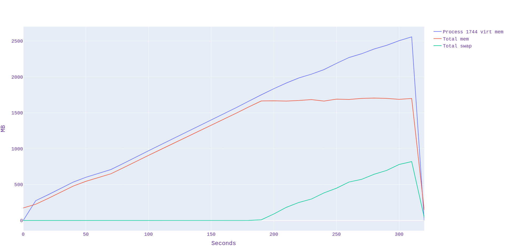
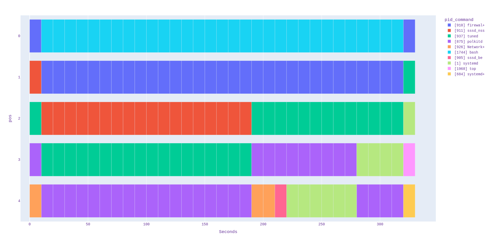

### Часть 2

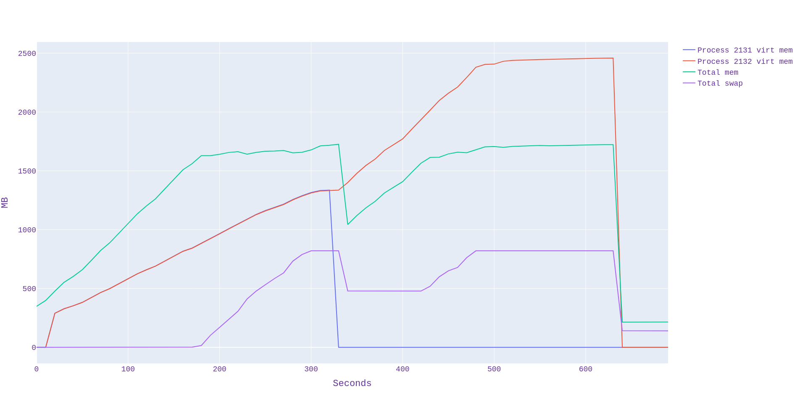
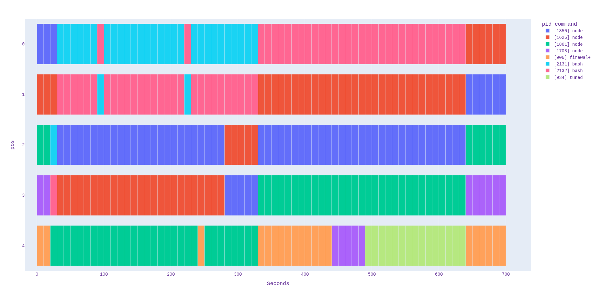

## Эксперимент 2

### Часть 1

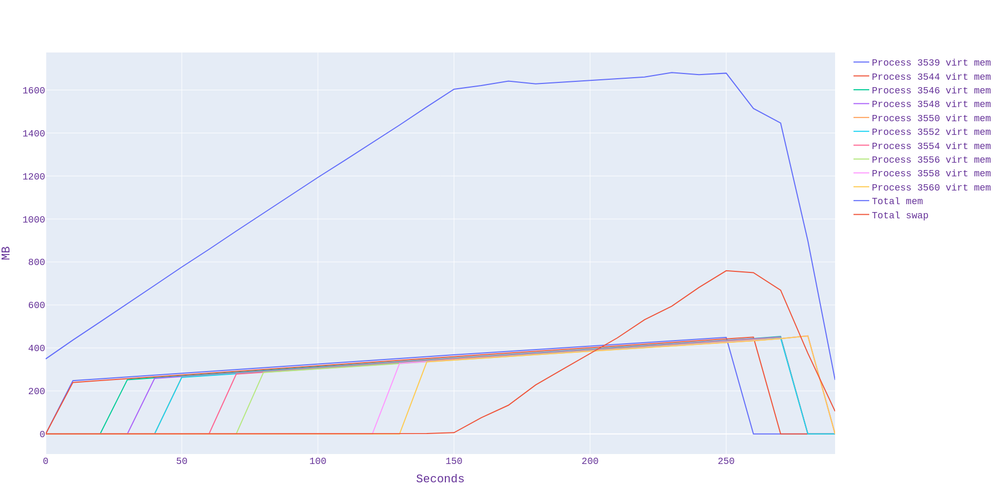

### Часть 2

#### n = 3 million
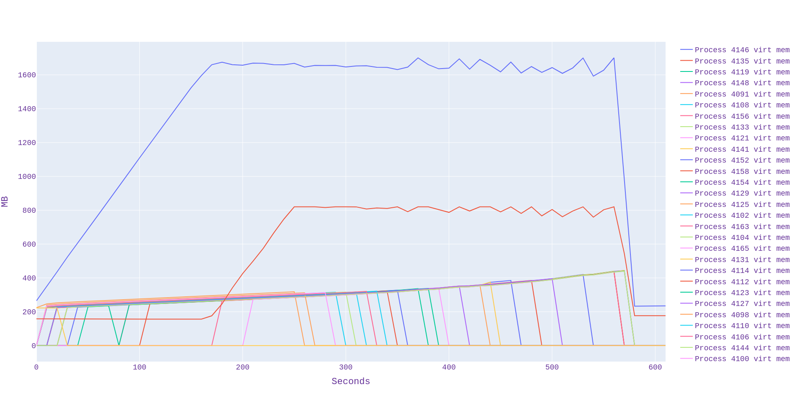

##### dmesg:
```
[ 2774.253881] Out of memory: Killed process 4091 (bash) total-vm:320196kB, anon-rss:51736kB, file-rss:0kB, shmem-rss:0kB, UID:0 pgtables:268kB oom_score_adj:0
[ 2774.286505] oom_reaper: reaped process 4091 (bash), now anon-rss:0kB, file-rss:0kB, shmem-rss:0kB

[ 2789.279147] Out of memory: Killed process 4098 (bash) total-vm:314784kB, anon-rss:52736kB, file-rss:0kB, shmem-rss:0kB, UID:0 pgtables:252kB oom_score_adj:0
[ 2789.289189] oom_reaper: reaped process 4098 (bash), now anon-rss:0kB, file-rss:0kB, shmem-rss:0kB

[ 2822.288752] Out of memory: Killed process 4100 (bash) total-vm:316764kB, anon-rss:55136kB, file-rss:0kB, shmem-rss:0kB, UID:0 pgtables:252kB oom_score_adj:0
[ 2822.303010] oom_reaper: reaped process 4100 (bash), now anon-rss:0kB, file-rss:0kB, shmem-rss:0kB

[ 2838.231637] Out of memory: Killed process 4102 (bash) total-vm:317952kB, anon-rss:57260kB, file-rss:0kB, shmem-rss:0kB, UID:0 pgtables:260kB oom_score_adj:0
[ 2838.243871] oom_reaper: reaped process 4102 (bash), now anon-rss:0kB, file-rss:0kB, shmem-rss:0kB

[ 3141.748165] Out of memory: Killed process 4127 (bash) total-vm:403620kB, anon-rss:121540kB, file-rss:0kB, shmem-rss:0kB, UID:0 pgtables:428kB oom_score_adj:0
[ 3141.783565] oom_reaper: reaped process 4127 (bash), now anon-rss:0kB, file-rss:0kB, shmem-rss:0kB

[ 3220.605060] Out of memory: Killed process 4133 (bash) total-vm:442560kB, anon-rss:150964kB, file-rss:0kB, shmem-rss:0kB, UID:0 pgtables:504kB oom_score_adj:0
[ 3220.643486] oom_reaper: reaped process 4133 (bash), now anon-rss:0kB, file-rss:0kB, shmem-rss:0kB
```

#### n = 1500 thousands 
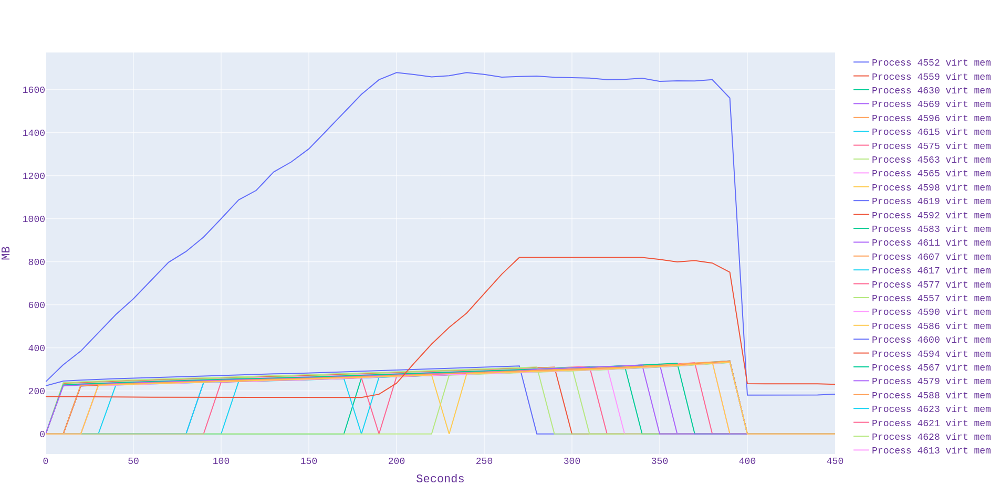

##### dmesg:
```
[ 3720.716759] Out of memory: Killed process 4552 (bash) total-vm:318480kB, anon-rss:55344kB, file-rss:4kB, shmem-rss:0kB, UID:0 pgtables:268kB oom_score_adj:0
[ 3720.744867] oom_reaper: reaped process 4552 (bash), now anon-rss:0kB, file-rss:0kB, shmem-rss:0kB

[ 3738.221093] Out of memory: Killed process 4557 (bash) total-vm:313200kB, anon-rss:53020kB, file-rss:0kB, shmem-rss:0kB, UID:0 pgtables:256kB oom_score_adj:0
[ 3738.234281] oom_reaper: reaped process 4557 (bash), now anon-rss:0kB, file-rss:0kB, shmem-rss:0kB

[ 3750.221093] Out of memory: Killed process 4559 (bash) total-vm:313240kB, anon-rss:53024kB, file-rss:0kB, shmem-rss:0kB, UID:0 pgtables:260kB oom_score_adj:0
[ 3750.336519] oom_reaper: reaped process 4559 (bash), now anon-rss:0kB, file-rss:0kB, shmem-rss:0kB

[ 3763.097408] Out of memory: Killed process 4563 (bash) total-vm:312936kB, anon-rss:56520kB, file-rss:0kB, shmem-rss:0kB, UID:0 pgtables:244kB oom_score_adj:0
[ 3763.125635] oom_reaper: reaped process 4563 (bash), now anon-rss:0kB, file-rss:0kB, shmem-rss:0kB

[ 3777.309844] Out of memory: Killed process 4575 (bash) total-vm:315972kB, anon-rss:64584kB, file-rss:0kB, shmem-rss:0kB, UID:0 pgtables:256kB oom_score_adj:0
[ 3777.325290] oom_reaper: reaped process 4575 (bash), now anon-rss:0kB, file-rss:0kB, shmem-rss:0kB

[ 3792.649265] Out of memory: Killed process 4565 (bash) total-vm:317424kB, anon-rss:61312kB, file-rss:0kB, shmem-rss:0kB, UID:0 pgtables:260kB oom_score_adj:0
[ 3792.664212] oom_reaper: reaped process 4565 (bash), now anon-rss:0kB, file-rss:0kB, shmem-rss:0kB

[ 3806.965648] Out of memory: Killed process 4583 (bash) total-vm:320592kB, anon-rss:69308kB, file-rss:0kB, shmem-rss:0kB, UID:0 pgtables:268kB oom_score_adj:0
[ 3806.981592] oom_reaper: reaped process 4583 (bash), now anon-rss:0kB, file-rss:0kB, shmem-rss:0kB
```

#### n = 750 thousands 
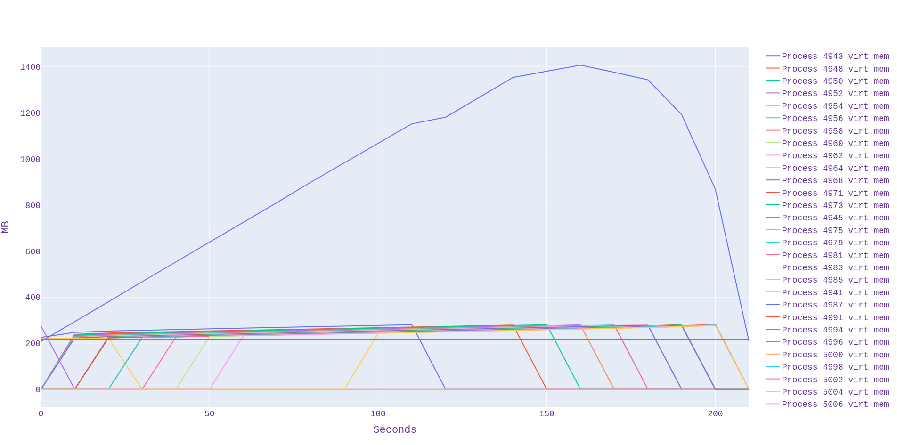

#### n = 1125 thousands 
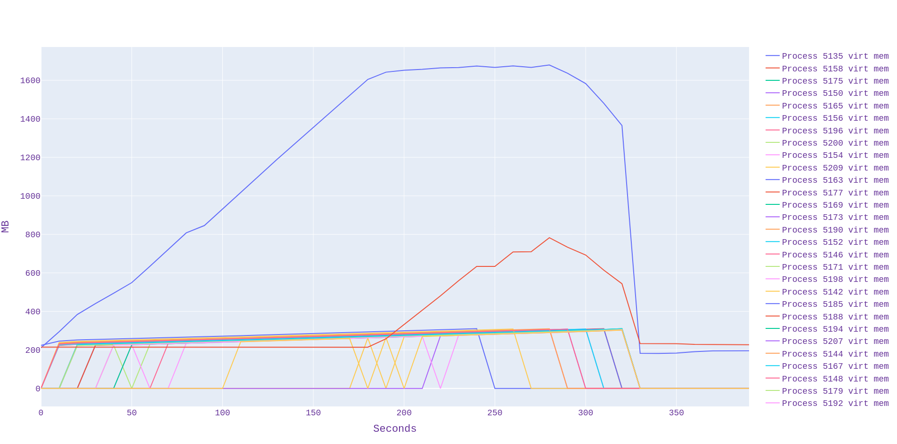

#### n = 1250 thousands 
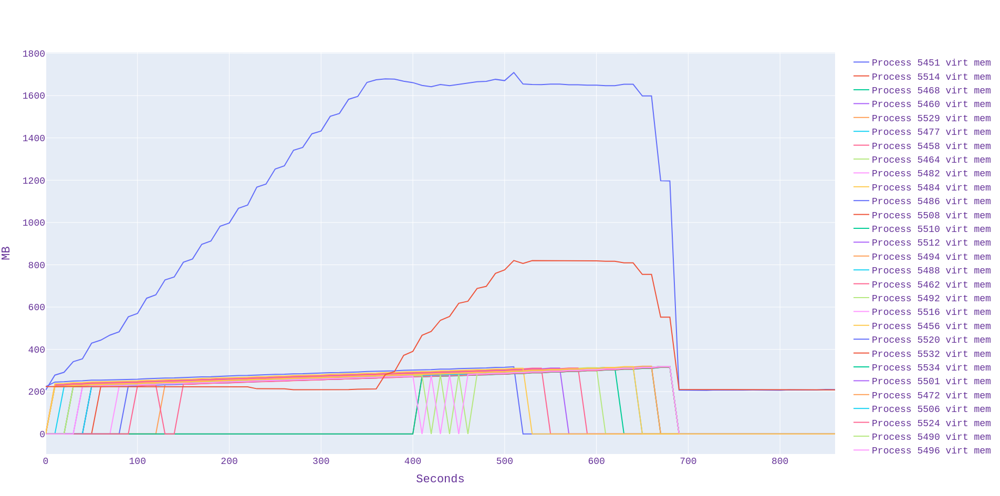

##### dmesg:
```
[ 5792.052004] Out of memory: Killed process 5451 (bash) total-vm:318480kB, anon-rss:64844kB, file-rss:0kB, shmem-rss:0kB, UID:0 pgtables:260kB oom_score_adj:0
[ 5792.062148] oom_reaper: reaped process 5451 (bash), now anon-rss:0kB, file-rss:0kB, shmem-rss:0kB

[ 5807.444854] Out of memory: Killed process 5456 (bash) total-vm:313860kB, anon-rss:52628kB, file-rss:0kB, shmem-rss:0kB, UID:0 pgtables:260kB oom_score_adj:0
[ 5807.471865] oom_reaper: reaped process 5456 (bash), now anon-rss:0kB, file-rss:0kB, shmem-rss:0kB

[ 5821.313752] Out of memory: Killed process 5458 (bash) total-vm:313464kB, anon-rss:54640kB, file-rss:0kB, shmem-rss:0kB, UID:0 pgtables:248kB oom_score_adj:0
[ 5821.327929] oom_reaper: reaped process 5458 (bash), now anon-rss:0kB, file-rss:0kB, shmem-rss:0kB

[ 5833.865382] Out of memory: Killed process 5460 (bash) total-vm:313860kB, anon-rss:56304kB, file-rss:4kB, shmem-rss:0kB, UID:0 pgtables:252kB oom_score_adj:0
[ 5834.112535] oom_reaper: reaped process 5460 (bash), now anon-rss:0kB, file-rss:0kB, shmem-rss:0kB

[ 5849.466523] Out of memory: Killed process 5462 (bash) total-vm:314652kB, anon-rss:58112kB, file-rss:0kB, shmem-rss:0kB, UID:0 pgtables:260kB oom_score_adj:0
[ 5849.494038] oom_reaper: reaped process 5462 (bash), now anon-rss:0kB, file-rss:0kB, shmem-rss:0kB

[ 5863.304304] Out of memory: Killed process 5464 (bash) total-vm:316500kB, anon-rss:60504kB, file-rss:0kB, shmem-rss:0kB, UID:0 pgtables:256kB oom_score_adj:0
[ 5863.337118] oom_reaper: reaped process 5464 (bash), now anon-rss:0kB, file-rss:0kB, shmem-rss:0kB

[ 5878.075622] Out of memory: Killed process 5468 (bash) total-vm:318348kB, anon-rss:63252kB, file-rss:0kB, shmem-rss:0kB, UID:0 pgtables:264kB oom_score_adj:0
[ 5878.248061] oom_reaper: reaped process 5468 (bash), now anon-rss:0kB, file-rss:0kB, shmem-rss:0kB
```

#### n = 1200 thousands 
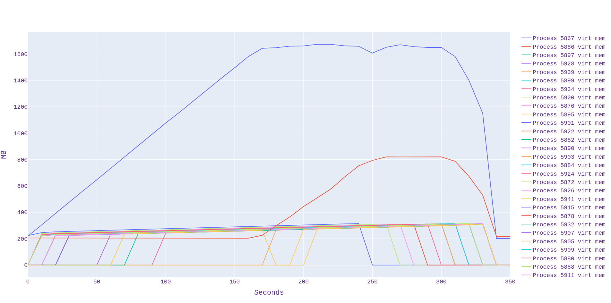

dmesg:
```
[ 6446.019218] Out of memory: Killed process 5872 (bash) total-vm:313728kB, anon-rss:53032kB, file-rss:0kB, shmem-rss:0kB, UID:0 pgtables:256kB oom_score_adj:0
[ 6446.029821] oom_reaper: reaped process 5872 (bash), now anon-rss:0kB, file-rss:0kB, shmem-rss:0kB

[ 6459.820313] Out of memory: Killed process 5876 (bash) total-vm:312804kB, anon-rss:54528kB, file-rss:4kB, shmem-rss:0kB, UID:0 pgtables:256kB oom_score_adj:0
[ 6459.834309] oom_reaper: reaped process 5876 (bash), now anon-rss:0kB, file-rss:0kB, shmem-rss:0kB

[ 6475.400454] Out of memory: Killed process 5878 (bash) total-vm:312804kB, anon-rss:55784kB, file-rss:0kB, shmem-rss:0kB, UID:0 pgtables:248kB oom_score_adj:0
[ 6475.423330] oom_reaper: reaped process 5878 (bash), now anon-rss:0kB, file-rss:0kB, shmem-rss:0kB

[ 6490.877935] Out of memory: Killed process 5880 (bash) total-vm:314256kB, anon-rss:57816kB, file-rss:0kB, shmem-rss:0kB, UID:0 pgtables:260kB oom_score_adj:0
[ 6491.005917] oom_reaper: reaped process 5880 (bash), now anon-rss:0kB, file-rss:0kB, shmem-rss:0kB

```